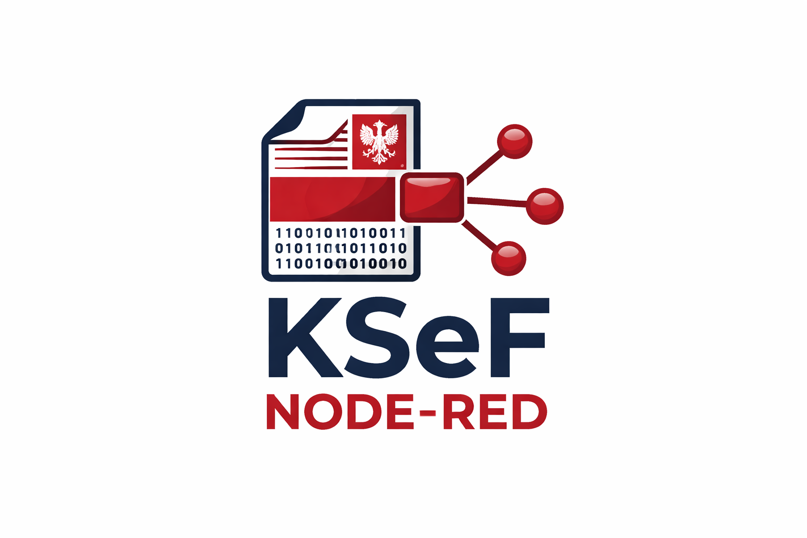
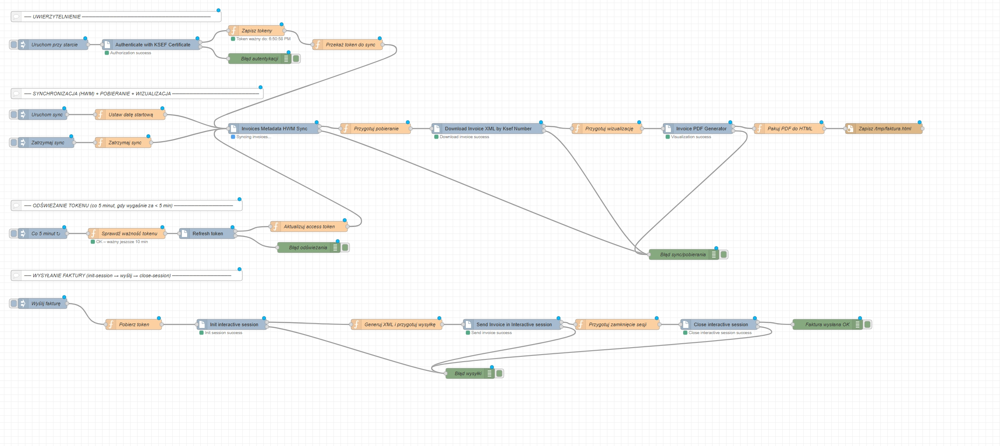

# @michalkuzma01/node-red-ksef

A collection of Node-RED nodes for interacting with the Polish National e-Invoice System (KSeF).

> ⚠️⚠️⚠️ **WARNING!!!** This node is **not optimized for retrieving thousands of invoices** due to the way the flows interact with KSeF endpoints (`/api/v2/invoices/query/metadata` -> `/api/v2/invoices/ksef/{ksefNumber}`). Use with large volumes cautiously.

> ⚠️⚠️⚠️ **ALWAYS CHECK!!!** Before syncing large batches, **verify limits** and current rules:
>
> - GitHub repository: [https://github.com/CIRFMF/ksef-docs](https://github.com/CIRFMF/ksef-docs)
> - Official KSeF Swagger API (link in the repo documentation)

# How to use

## 1. Installation

You can install this node directly from the Node-RED palette manager. Search for `@michalkuzma01/node-red-ksef`.

Alternatively, you can install it manually from your Node-RED user directory (usually `~/.node-red`):

```
npm install @michalkuzma01/node-red-ksef
```

## 2. Certificates

Log in to your KSeF account and download your certificate and private key files. Configure the paths in the **KSEF Auth** node.

## 3. Example Flow



An example flow for Node-RED is included in `examples/ksef-complete-flow.json`. **Warning:** before using it, carefully review the flow and replace all placeholder data with your own (e.g., NIP, certificate paths, keys).

The default `Base URL` in the example is set to the **KSeF Preprod API**, so the flow will not work immediately in the production environment. The example is provided **for inspiration only** and should be adapted to your specific setup.

## Supported Nodes

This package provides the following nodes to facilitate communication with the KSeF system.
All nodes, except **Invoice PDF Generator** (which runs locally), allow you to configure the `Base URL` setting to switch between KSeF environments (test, demo, production). The default is set to the **production** environment.

---

### KSEF Auth

Authorizes with KSeF using a provided certificate. This node initiates an interactive session with the KSeF system.

**Node configuration:**

| Setting                            | Description                                           |
| :--------------------------------- | :---------------------------------------------------- |
| Base URL                           | KSeF API base URL (e.g. `https://api.ksef.mf.gov.pl`) |
| Subject Identifier Type            | `certificateSubject` or `certificateFingerprint`      |
| Context Identifier Type            | `Nip`, `InternalId`, or `NipVatUe`                    |
| Context Identifier Value           | The NIP or internal ID to authorize as                |
| Private Key Filepath               | Absolute path to the private key file                 |
| Certificate Filepath               | Absolute path to the certificate file                 |
| Key Passphrase                     | Passphrase for the private key (if encrypted)         |
| Verify Certificate Chain           | Whether to verify the full certificate chain          |
| Algorithm Type                     | `RSA` or `ECDSA`                                      |
| Auth Polling Max Retries           | How many times to poll for auth status (default: 5)   |
| Auth Polling Initial Interval (ms) | Initial polling interval in ms (default: 1000)        |

**Input:**

| Input Property | Type  | Description                                                   |
| :------------- | :---- | :------------------------------------------------------------ |
| `msg`          | `any` | Any incoming message will trigger the authentication process. |

**Output:**

| Output Port  | Output Property | Type     | Description                                                                                |
| :----------- | :-------------- | :------- | :----------------------------------------------------------------------------------------- |
| `0` (Tokens) | `msg.payload`   | `object` | Authentication tokens (e.g. `accessToken`, `refreshToken`) for subsequent KSeF operations. |
| `1` (Error)  | `msg.payload`   | `object` | Error object with details if the authentication process fails.                             |

---

### Init Interactive Session

Opens an interactive session in KSeF. The session is identified by a reference number that must be passed to the **Send Invoice** and **Close Interactive Session** nodes.

**Input `msg.payload`:**

| Property      | Type     | Description                |
| :------------ | :------- | :------------------------- |
| `accessToken` | `string` | A valid KSeF access token. |

**Output:**

| Output Port            | Output Property   | Type     | Description                                                 |
| :--------------------- | :---------------- | :------- | :---------------------------------------------------------- |
| `0` (Reference Number) | `msg.payload`     | `object` | Session reference number and related data returned by KSeF. |
| `0` (Reference Number) | `msg.originalMsg` | `object` | The original input message.                                 |
| `1` (Error)            | `msg.payload`     | `object` | Error object with details if opening the session fails.     |
| `1` (Error)            | `msg.originalMsg` | `object` | The original input message.                                 |

---

### Send Invoice in Interactive Session

Sends an invoice to the KSeF system within an open interactive session. The invoice XML is encrypted with AES-CBC before transmission.

**Input `msg.payload`:**

| Property          | Type     | Description                                                     |
| :---------------- | :------- | :-------------------------------------------------------------- |
| `accessToken`     | `string` | A valid KSeF access token for the active interactive session.   |
| `referenceNumber` | `string` | The session reference number from **Init Interactive Session**. |
| `invoiceXml`      | `string` | The XML content of the invoice to be sent.                      |
| `aesKey`          | `string` | Base64-encoded AES-256 key used to encrypt the invoice.         |
| `iv`              | `string` | Base64-encoded initialization vector (IV) for AES-CBC.          |

**Output:**

| Output Port   | Output Property   | Type     | Description                                                                      |
| :------------ | :---------------- | :------- | :------------------------------------------------------------------------------- |
| `0` (UPO XML) | `msg.payload`     | `object` | Official Proof of Receipt (UPO) data from KSeF confirming successful submission. |
| `0` (UPO XML) | `msg.originalMsg` | `object` | The original input message.                                                      |
| `1` (Error)   | `msg.payload`     | `object` | Error object with details if the invoice submission fails.                       |
| `1` (Error)   | `msg.originalMsg` | `object` | The original input message.                                                      |

---

### Close Interactive Session

Closes an active interactive session in KSeF.

**Input `msg.payload`:**

| Property          | Type     | Description                            |
| :---------------- | :------- | :------------------------------------- |
| `accessToken`     | `string` | A valid KSeF access token.             |
| `referenceNumber` | `string` | The session reference number to close. |

**Output:**

| Output Port            | Output Property   | Type     | Description                                             |
| :--------------------- | :---------------- | :------- | :------------------------------------------------------ |
| `0` (Reference Number) | `msg.payload`     | `object` | Session close result returned by KSeF.                  |
| `0` (Reference Number) | `msg.originalMsg` | `object` | The original input message.                             |
| `1` (Error)            | `msg.payload`     | `object` | Error object with details if closing the session fails. |
| `1` (Error)            | `msg.originalMsg` | `object` | The original input message.                             |

---

### Download Invoice XML by KSeF Number

Downloads a KSeF invoice in XML format using its KSeF identification number and an authentication token.

**Input `msg`:**

| Property     | Type     | Description                             |
| :----------- | :------- | :-------------------------------------- |
| `ksefNumber` | `string` | The KSeF invoice identification number. |
| `authToken`  | `string` | A valid KSeF access token.              |

**Output:**

| Output Port | Output Property          | Type     | Description                                                                                                 |
| :---------- | :----------------------- | :------- | :---------------------------------------------------------------------------------------------------------- |
| `0` (XML)   | `msg.payload`            | `object` | Object containing the downloaded invoice XML and the original input `msg.payload` (e.g. `InvoiceMetadata`). |
| `0` (XML)   | `msg.payload.invoiceTxt` | `string` | The XML content of the downloaded invoice.                                                                  |
| `0` (XML)   | `msg.payload.decodedMsg` | `any`    | The original input `msg.payload` passed through (e.g. full `InvoiceMetadata` from HWM sync).                |
| `0` (XML)   | `msg.originalMsg`        | `object` | The original input message.                                                                                 |
| `1` (Error) | `msg.payload`            | `object` | Error object with details if the invoice download fails.                                                    |
| `1` (Error) | `msg.originalMsg`        | `object` | The original input message.                                                                                 |

---

### Refresh Token

Refreshes an existing KSeF access token and returns a new one.

**Input `msg`:**

| Property      | Type     | Description                          |
| :------------ | :------- | :----------------------------------- |
| `accessToken` | `string` | The current access token to refresh. |

**Output:**

| Output Port     | Output Property   | Type     | Description                                             |
| :-------------- | :---------------- | :------- | :------------------------------------------------------ |
| `0` (New Token) | `msg.payload`     | `object` | `{ newTokenValue: string, newTokenValidUntil: string }` |
| `0` (New Token) | `msg.originalMsg` | `object` | The original input message.                             |
| `1` (Error)     | `msg.payload`     | `object` | Error object with details if the token refresh fails.   |
| `1` (Error)     | `msg.originalMsg` | `object` | The original input message.                             |

---

### Invoices Metadata HWM Continuous Sync

Continuously fetches invoice metadata from KSeF using a high-water-mark (HWM) strategy — it picks up from where it last left off and polls at a configured interval. Each invoice metadata record is emitted as a separate output message.

**Node configuration:**

| Setting             | Description                                                                                                                                  |
| :------------------ | :------------------------------------------------------------------------------------------------------------------------------------------- |
| Base URL            | KSeF API base URL (e.g. `https://api.ksef.mf.gov.pl`)                                                                                        |
| Sync Interval (min) | How often to poll for new invoices (must be > 0)                                                                                             |
| Subject Type        | `Subject1`, `Subject2`, `Subject3`, or `SubjectAuthorized`                                                                                   |
| Date Type           | `Issue`, `Invoicing`, or `PermanentStorage`                                                                                                  |
| Date To             | Upper bound for the date range filter                                                                                                        |
| Various filters     | Optional: KSeF number, amount range, seller NIP, buyer identifier, currency codes, invoicing mode, form type, invoice types, attachment flag |

**Input (controlled via `msg.topic`):**

| `msg.topic` | `msg.payload`                            | Description                                 |
| :---------- | :--------------------------------------- | :------------------------------------------ |
| `authToken` | `{ accessToken: { token: string } }`     | Sets or updates the auth token for polling. |
| `from`      | `{ dateFrom: string }` (ISO date string) | Starts the sync from the specified date.    |
| `stop`      | _(any)_                                  | Stops the running sync.                     |

**Output:**

| Output Port   | Output Property | Type     | Description                                                      |
| :------------ | :-------------- | :------- | :--------------------------------------------------------------- |
| `0` (Invoice) | `msg.payload`   | `object` | A single invoice metadata record emitted for each invoice found. |
| `1` (Error)   | `msg.payload`   | `object` | Error object if a sync error occurs.                             |

---

### Invoice PDF Generator

Generates a PDF visualization of a KSeF invoice from its XML content. Supports FA(1), FA(2), and FA(3) form types. This node runs **locally** and does not make any network requests.

**Input `msg`:**

| Property     | Type     | Description                                                   |
| :----------- | :------- | :------------------------------------------------------------ |
| `xml`        | `string` | The XML content of the invoice.                               |
| `ksefNumber` | `string` | The KSeF invoice identification number.                       |
| `qrCodeURL`  | `string` | URL to be encoded as a QR code on the PDF.                    |
| `isMobile`   | `string` | `"true"` or `"false"` — whether to use the mobile PDF layout. |

**Output:**

| Output Port | Output Property   | Type     | Description                                        |
| :---------- | :---------------- | :------- | :------------------------------------------------- |
| `0` (PDF)   | `msg.payload`     | `string` | Base64-encoded PDF of the invoice.                 |
| `0` (PDF)   | `msg.originalMsg` | `object` | The original input message.                        |
| `1` (Error) | `msg.payload`     | `object` | Error object with details if PDF generation fails. |
| `1` (Error) | `msg.originalMsg` | `object` | The original input message.                        |

---

# Development

## How to regenerate test certificates

```
./test/e2e/utils/gen-ksef-cert.sh --nip 1234567890 --cn "Jan Kowalski" --given "Jan" --surname "Kowalski" --out ./test/e2e/resources/
```

If you change NIP during certificate regeneration, remember to update it in `default-config-provider.ts` and `invoice-sample-1.xml.njk` as well.

## License

This project is licensed under AGPLv3.

If you want to use it in a closed-source or commercial product,
a separate commercial license is available.

Contact: michal@kuzma.it
